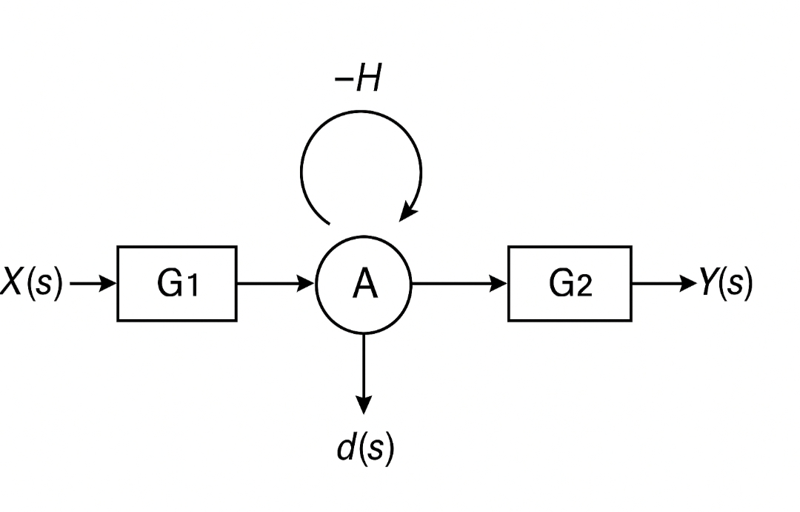

# 題目

考慮一個單迴路控制系統，其訊號流圖如下（文字方塊圖表示）：

- 輸入：$X(s)$  
- 輸出：$Y(s)$  
- 在節點 $A$ 有一個自迴路，增益 $-H$  
- 在節點 $A$ 加入雜訊 $d(s)$  

**問題：**  
1. 求 $X(s)$ 到 $Y(s)$ 的傳遞函數 $T_x(s)=\dfrac{Y(s)}{X(s)}$。  
2. 求雜訊 $d(s)$ 到 $Y(s)$ 的傳遞函數（雜訊增益） $T_d(s)=\dfrac{Y(s)}{D(s)}$。  

---

# 解答

## 解題步驟

### 1) 找分子（各前向路徑的 $P_k \Delta_k$，最後相加）

- 前向路徑：  
  - $P_1: X \to A \to Y$，增益 $P_1 = G_1 G_2$  
  - $P_d: d \to A \to Y$，增益 $P_d = G_2$  

- 迴路：  
  - $L_1 = -H$（節點 $A$ 自迴路）  

- $\Delta_k$ 的判斷：  
  - $P_1$ 經過節點 $A$，與 $L_1$ 相交 → $\Delta_1 = 1$  
  - $P_d$ 也經過節點 $A$，與 $L_1$ 相交 → $\Delta_d = 1$  

- 分子計算：  
  - 對 $X$：$P_1 \Delta_1 = G_1 G_2$  
  - 對 $d$：$P_d \Delta_d = G_2$

---

### 2) 找分母（整圖的判別式 $\Delta$）

- 判別式定義：  

$$
  \Delta = 1 - \sum(\text{單一迴路增益})
  + \sum(\text{兩兩不相交迴路乘積})
  - \cdots
$$

- 本例只有一個迴路 $L_1=-H$，因此  

$$
  \Delta = 1 - L_1 = 1 - (-H) = 1 + H
$$

---

### 3) 帶公式（Mason’s Gain Formula）

- Mason 公式：  
$$
T = \frac{Y}{\text{來源}} = \frac{\sum_k P_k \Delta_k}{\Delta}
$$

- 對輸入 $X$：  

$$
T_x(s) = \frac{Y}{X}  = \frac{G_1 G_2}{1+H}
$$

- 對雜訊 $d$：  

$$
T_d(s) = \frac{Y}{D} = \frac{G_2}{1+H}
$$

---

# 最終答案

1. $X(s)$ 到 $Y(s)$ 的傳遞函數：  

$$
T_x(s) = \frac{G_1 G_2}{1+H}
$$  

2. 雜訊 $d(s)$ 到 $Y(s)$ 的傳遞函數（雜訊增益）：  

$$
T_d(s) = \frac{G_2}{1+H}
$$

