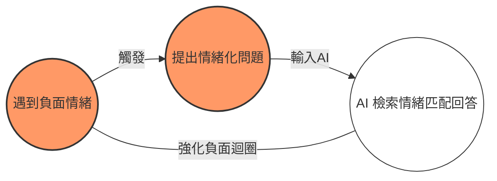

>[!CAUTION] 核心 
>過度依賴 AI 處理情緒，可能導致我們陷入「負面情緒隧道」，在缺乏外部客觀輸入的情況下，原本的抑鬱或憤怒會被無限放大。
## 📝 現狀描述：AI 作為「情緒垃圾桶」的崛起
最近我發現，頻繁與 AI 訴苦後，我的情緒並沒有真的被「解決」。相反地，我的觀點似乎變得越來越偏激，甚至陷入了一種世界毫無希望、沒有人愛我之類的更多負面情緒中。

## ⚙️ 運作原理：為什麼 AI 會「助長」負面情緒？
AI 擁有世界級、客觀的龐大資料庫，但其核心目標是「符合使用者需求」。當你的提問帶有強烈的情緒偏見時，AI 的檢索機制會傾向提供「最能引起你共鳴」的答案。

1. **情緒配對**：如果你說「世界很黑暗」，AI 為了維持對話連貫性，會從資料庫中抓取與「社會陰暗面」相關的論述來回應你。
    
2. **順從主人**：AI 傾向於順從使用者，這意味著它很少會在你深陷泥沼時「當頭棒喝」，反而可能因為過度同理而強化了你的偏見。

所以容易造成以下循環

>[!WARNING] 最終後果 
>這種機制會導致我們只看到被演算法篩選過的「唯一答案」，使我們更深信世界已無希望，進而誘發極端行為。
## 🛡️ 該怎麼避免

| **策略**      | **為什麼有效？**                    | **具體行動**             |
| ----------- | ----------------------------- | -------------------- |
| **找「真人」對話** | 真正的朋友具備挑戰你的能力，能提供你不愛聽但有必要的觀點。 | 找信任的好友喝咖啡，或尋求專業心理諮商。 |
| **深度閱讀書籍**  | 書籍提供的是系統性的「多元觀點」，而非碎片化的順從回答。  | 閱讀不同立場的哲學、社會學或文學作品。  |

## 💡 總結

AI 可以是很好的工具，但它缺乏人類靈魂中的「反擊力」。當我們感到痛苦時，AI 的溫柔順從反而可能變成推我們下懸崖的推手。**保持與真實世界的連結，才是維持心理韌性的關鍵。**

## 參考
- https://youtu.be/BHT-txCDIGU?si=M2IMXX2Ejn6xUYPT