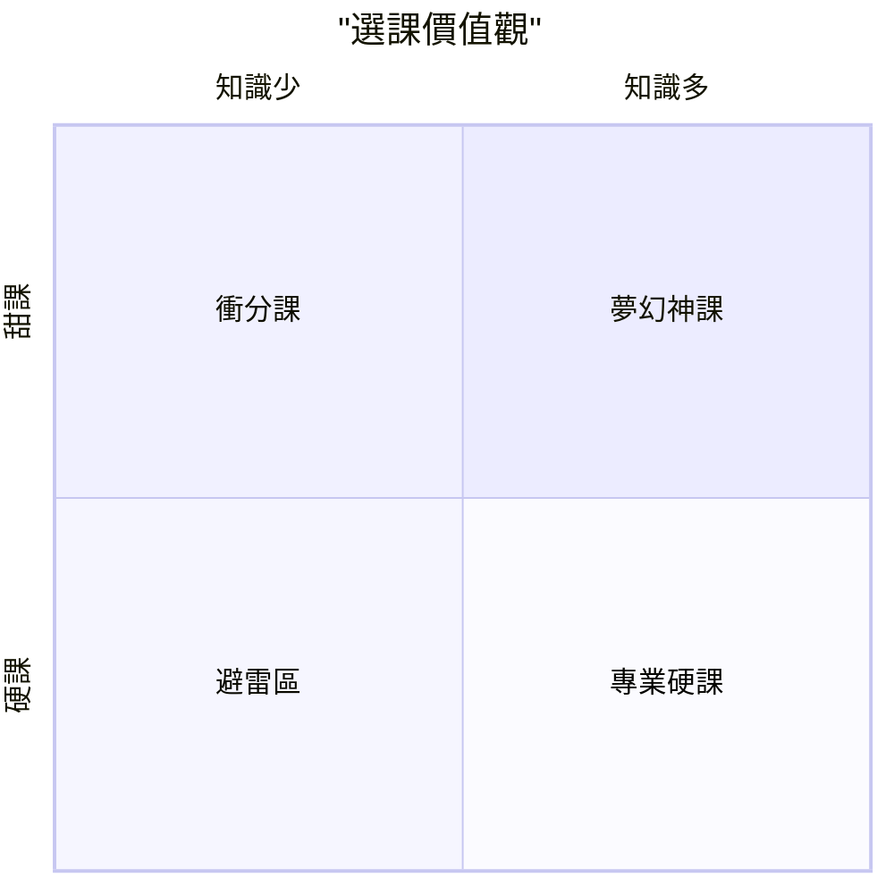

>20250219:又又又是選課時間，我訪問了數位朋友，歸納出以下筆記。

## 🎓 大學選課決策模型：GPA 與知識的權衡
### 🔍 選課的核心提問
在進入battle前，必須先誠實自問兩個關鍵問題：
 * 成績考量（GPA）： 我現在是否處於需要衝高平均分數的階段（如：準備留學、申請獎學金）？
 * 知識價值： 這門課的內容對我未來的職涯或自我成長是否具備不可替代性？
## 👥 三種典型選課人格
根據朋友自述「能力」與「價值偏好」的交集，我歸納出以下三種導向：

| 人格類型 | 核心邏輯 | 決策偏好 |
|---|---|---|
| GPA 優先型 | 雖然想學東西，但判定自己無法兼顧難度與成績，且成績的吸引力較大。 | 選擇「甜課」（給分優厚、負擔輕）。 |
| 求知優先型 | 評估過低成績的後果在承受範圍內，極度重視課程內容的收穫。 | 選擇「硬核興趣課」（內容扎實、不計分）。 |
| 能力卓越型 | 具備足夠能力（或自信）處理困難課程，且重視學到東西。 | 無視難度，專注於「喜好」。 |
### 📊 決策工具：選課四象限法
選課就像是一場「四象限填空題」。我們可以將所有課程依照以下軸線進行定位：

**座標軸定義**
 * 橫軸（X）： 知識含量（低 → 高）
 * 縱軸（Y）： 成績甜度（難拿高分 → 容易拿高分）
**四象限分析**
 * 第一象限（高知識、高甜度）： 神課，必選。
 * 第二象限（低知識、高甜度）： 衝分課，適合衝 GPA 或換取時間。
 * 第三象限（低知識、低甜度）： 避雷區，應盡量避免。
 * 第四象限（高知識、低甜度）： 硬課，適合對該領域有極高熱忱者。

> [!tip] 結論
> 選課的本質是定位自己在象限的何處。先確認當下的價值觀需求，再將課程一一比對，選擇最接近你當前價值座標的選項。

### 📝 我的行動清單
 * [ ] 列出本學期候選課程清單（不管是想要還是必修）。
 * [ ] 標註哪些課屬於「硬課」或「甜課」。
 * [ ] 定義自己本學期的核心目標（是衝 GPA 還是求知？）。
 * [ ] 根據四象限進行最終排序。
